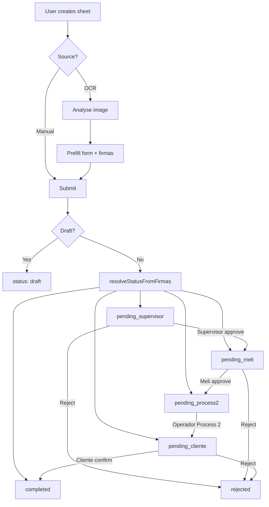

# Plastic Trade TrackingSystem — Web Developer Handoff

**Purpose:** Detailed product + technical workflow so the web app can match the existing React Native mobile app and share the same Firebase backend.

**Mobile project:** `TrackingSystem` (React Native)  
**Firebase project ID:** `plastictrade-8649c`  
**Backend model:** **Firebase only** (Auth, Firestore, Storage, Cloud Functions, FCM). Do **not** rebuild the removed Express `server/` or `backend/` folders.

**Languages:** Spanish (`es`, default) and English (`en`).

---

## 1. Product overview

The app digitizes Plastic Trade **Orden de Salida** (service / exit sheets): paper forms → digital records with a multi-role approval chain.

### Two processes (match the paper form)

| Process | Paper labels | App roles |
|---------|--------------|-----------|
| **Process 1** | Elaboró → Responsable → Autoriza | `elaboro` → `supervisor` → `meli` |
| **Process 2** | Recibió y entregó → Recibió (cliente) | `operador` → `cliente` |

Users can create sheets **manually** or by **scanning** the paper form (OCR). OCR can skip already-signed approval steps using `firmas.*.filled`.

---

## 2. Architecture (shared with web)

```
┌─────────────────┐     ┌─────────────────┐
│  Mobile (RN)    │     │  Web (new)      │
└────────┬────────┘     └────────┬────────┘
         │                       │
         └───────────┬───────────┘
                     ▼
         ┌───────────────────────┐
         │  Firebase             │
         │  • Auth               │
         │  • Firestore          │
         │  • Storage            │
         │  • Cloud Functions    │
         │  • FCM / Web Push*    │
         └───────────┬───────────┘
                     │
         ┌───────────▼───────────┐
         │  OCR analyse API      │
         │  (Railway HTTP)       │
         │  OpenCV + ML Kit JSON │
         └───────────────────────┘
```

\*Mobile uses FCM today. Web can use FCM Web Push or another channel; Cloud Function already sends FCM on status change.

### Important paths / collections

| Resource | Path / name |
|----------|-------------|
| Users | `users/{uid}` |
| Sheets | `serviceSheets/{sheetId}` |
| Role requests | `roleChangeRequests/{id}` |
| Site requests | `siteChangeRequests/{id}` |
| Catalog | `materials`, `measureUnits`, `transportUnits`, `sites` |
| FCM tokens | `users/{uid}/fcmTokens/{tokenId}` |
| Scan image | Storage `serviceSheets/{sheetId}/scan.jpg` |
| Document AI OCR | Callable `processServiceSheetOcr` |
| OpenCV OCR | `POST https://plastictrade-image-fetcher-production.up.railway.app/process` |

Config references in mobile:

- OpenCV URL: `src/config/documentAnalyse.ts`
- Document AI function name: `src/config/documentAi.ts` → `processServiceSheetOcr`
- Rules: `firestore.rules`, `storage.rules`
- Types source of truth: `src/types/index.ts`

---

## 3. User roles

| Role id | UI label | Capabilities |
|---------|----------|--------------|
| `elaboro` | Elaboró (Plastic) | Default. Create/submit sheets (manual or OCR). Cannot approve. |
| `supervisor` | Responsable (Supervisor) | Approve/reject when `pending_supervisor`, **only** for sites in `assignedSiteIds`. |
| `meli` | Autoriza (Meli) | Approve/reject when `pending_meli`, site-scoped like supervisor. |
| `operador` | Recibió y entregó (Operador) | Complete Process 2 when `pending_process2` (any site). |
| `cliente` | Recibió (cliente) | Final confirm when `pending_cliente` → `completed` (any site). |
| `admin` | Administrator | Approve role/site requests; manage catalog; optional direct site override; can act as operador/cliente on sheets; bypasses site scoping in rules. |

**Requestable roles** (register / role-change request):  
`elaboro`, `supervisor`, `meli`, `operador`, `cliente`  

**`admin` is never self-requestable** — set manually in Firestore.

### Site scoping

Only **`supervisor`** and **`meli`** use `users/{uid}.assignedSiteIds`.

- Empty `assignedSiteIds` → cannot approve any site.
- `admin`, `operador`, `cliente`, `elaboro` → not limited by site assignment for access.

---

## 4. Authentication & user profile

### Auth methods (mobile)

- Email / password
- Google Sign-In
- Facebook Sign-In
- Optional biometric unlock on device (not a Firebase provider)

Web should support at least **email/password + Google** (Facebook optional).

### `users/{uid}` document

| Field | Type | Notes |
|-------|------|--------|
| `name` | string | Display name |
| `email` | string | |
| `role` | string | One of the roles above; missing → treat as `elaboro` |
| `assignedSiteIds` | `string[]` | Site doc ids; default `[]` |
| `createdAt` | ISO string | On create |
| `updatedAt` | ISO string | On profile / site updates |

App model: `{ id, name, email, role, assignedSiteIds }`.

### Subcollections under user

| Path | Purpose |
|------|---------|
| `users/{uid}/fcmTokens/{tokenId}` | `{ token, platform, updatedAt }` |
| `users/{uid}/checkIns/{id}` | Check-in records (legacy / not in main nav) |
| `users/{uid}/meta/activeCheckIn` | Active check-in pointer |
| `users/{uid}/serviceSheets/{id}` | **Deprecated** — do not use |

---

## 5. Role change requests (like a ticket)

**Collection:** `roleChangeRequests/{id}`  
**Id pattern:** `role-req-{timestamp}`

| Field | Values |
|-------|--------|
| `userId`, `userName`, `userEmail` | Requester |
| `currentRole`, `requestedRole` | Roles |
| `status` | `pending` \| `approved` \| `rejected` |
| `createdAt` | ISO |
| `reviewedAt`, `reviewedBy`, `reviewedByName`, `rejectionReason` | Optional after review |

### Flow

1. User opens Profile → Request role change → picks role → creates **pending** doc.
2. Admin sees pending list on **Home** → Approve or Reject.
3. **Approve:** set `users/{uid}.role = requestedRole`, mark request `approved`.
4. **Reject:** mark request `rejected` (optional reason).
5. User may **cancel** (delete) their own pending request.
6. Only **one pending** role request per user (enforced in app).

---

## 6. Site assignment requests

**Collection:** `siteChangeRequests/{id}`  
**Id pattern:** `site-req-{timestamp}`  
**Eligible roles:** `supervisor` \| `meli` only.

| Field | Notes |
|-------|--------|
| `userId`, `userName`, `userEmail` | |
| `currentSiteIds` | Current `assignedSiteIds` |
| `requestedSiteIds` | Requested site ids |
| `status` | `pending` \| `approved` \| `rejected` |
| Review fields | Same pattern as role requests |

### Flow

1. User (supervisor/meli) → Profile → **My sites** → select sites → send request.
2. Admin on Home → Approve / Reject.
3. **Approve:** write `users/{uid}.assignedSiteIds = requestedSiteIds`.
4. Admin may still **override** sites directly (mobile: Profile → Site assignments). That should supersede any pending request.

---

## 7. Service sheet lifecycle (core workflow)

### Status values (`SheetStatus`)

```
draft
pending_supervisor
pending_meli
pending_process2
pending_cliente
completed
approved     ← legacy terminal; treat as completed in UI
rejected
```

### Happy path (manual create, no OCR firmas skip)

```
Submit
  → pending_supervisor
  → (supervisor approve) pending_meli
  → (meli approve) pending_process2
  → (operador Process 2) pending_cliente
  → (cliente confirm) completed
```

Any approval step can go to `rejected` + `rejectionReason`.

### Transition table

| Actor | From | To | Side effects |
|-------|------|-----|--------------|
| Creator | create | `draft` or OCR-resolved status | On submit: `elaboroSignedAt` |
| Creator | `draft` / `rejected` | resubmit statuses | Allowed by rules |
| `supervisor` | `pending_supervisor` | `pending_meli` or `rejected` | `responsableSup`, `supervisorUserId`, `supervisorSignedAt` |
| `meli` | `pending_meli` | `pending_process2` or `rejected` | `autoriza`, `meliUserId`, `meliSignedAt` |
| `operador` / `admin` | `pending_process2` | `pending_cliente` | Per-line `kilograms`, warehouse times, `recibio`/`entrega`, `operadorUserId`, `operadorSignedAt` |
| `cliente` / `admin` | `pending_cliente` | `completed` or `rejected` | `recibe`, `clienteUserId`, `clienteSignedAt`, `process2CompletedAt/By/Name` |

Sheet id pattern on create: `sheet-{Date.now()}`.

---

## 8. OCR firmas → initial status (critical)

When submitting from OCR (not draft), status is computed from `firmas`:

**Logic:** first signature with `filled !== true` decides the pending status.

| Firmas key | Meaning | Gates status? |
|------------|---------|---------------|
| `elaboro_plastict` | Elaboró name | No (name only) |
| `responsable_supervisor` | Supervisor | Yes → else `pending_supervisor` |
| `autoriza_melii` | Meli | Yes → else `pending_meli` |
| `recibio_y_entrego_operador` | Operador | Yes → else `pending_process2` |
| `recibio_cliente` | Cliente | Yes → else `pending_cliente` |
| All approval firmas filled | — | `completed` |

Rules of thumb:

1. No `firmas` → `pending_supervisor`
2. Legacy OCR with no boolean `filled` flags → `pending_supervisor`
3. `filled: true` → skip that approval; use `value` (else `nombre` / `nombre_probable`) as signed name and set corresponding timestamps on create

**Example**

```json
"firmas": {
  "elaboro_plastict": { "filled": true, "value": "Soid" },
  "responsable_supervisor": { "filled": true, "value": "Unknown" },
  "autoriza_melii": { "filled": true, "value": "Marco Corona" },
  "recibio_y_entrego_operador": { "filled": true, "value": "Unknown" },
  "recibio_cliente": { "filled": false, "value": null }
}
```

→ Create sheet as **`pending_cliente`** with supervisor/meli/operador names already filled.

Firestore create rules allow status in:  
`draft`, `pending_supervisor`, `pending_meli`, `pending_process2`, `pending_cliente`, `completed`.

---

## 9. Service sheet data model

**Collection:** `serviceSheets/{sheetId}`

### Identity

| Field | Notes |
|-------|--------|
| `id` | Same as doc id |
| `codigo` | Often site code style string |
| `folio` | Usually 4 digits |
| `fecha` | Date string |
| `siteId`, `siteName` | Catalog site |
| `createdBy`, `createdByName`, `createdAt` | Creator |
| `status` | See above |
| `source` | `manual` \| `ocr` |
| `photoUri` | Storage download URL of scan |
| `rejectionReason` | Optional |

### Materials

```ts
materials: Array<{
  materialType: string;       // e.g. CARTON, PLAYO, OTRO
  customMaterialName?: string; // when OTRO
  quantity: number;
  unit: string;               // measure unit id, e.g. bulk, pieces
  kilograms?: number;         // Process 2 / OCR weigh
}>
```

### Transport / operator

| Field | Notes |
|-------|--------|
| `packagingType` | Transport unit id (`dryBox`, `tolva30`, …) |
| `operatorName`, `operatorId` | |
| `vehiclePlates`, `trailerPlates`, `sealNumber` | |
| `siteEntryTime`, `siteExitTime` | ISO |
| `warehouseEntryTime`, `warehouseExitTime` | ISO |

### Signature display names

| Field | Role |
|-------|------|
| `elaboro` | Elaboró |
| `responsableSup` | Supervisor |
| `autoriza` | Meli |
| `recibio`, `entrega` | Operador (same person; UI shows one row) |
| `recibe` | Cliente |

### Approval metadata

`elaboroSignedAt`, `supervisorSignedAt`, `meliSignedAt`, `operadorSignedAt`, `clienteSignedAt`,  
`supervisorUserId`, `meliUserId`, `operadorUserId`, `clienteUserId`,  
`process2CompletedAt`, `process2CompletedBy`, `process2CompletedByName`

### `sheetJson` (canonical OCR shape)

Stored on the sheet for audit / interoperability:

```json
{
  "documento": { "sitio": "MXCD-13", "folio": "0001", "fecha": "YYYY-MM-DD" },
  "materials": [
    { "material": "Cartón", "cantidad": 1, "unidad": "A granel" }
  ],
  "selected_unidad": "Caja seca",
  "kilogramos": { "Cartón": 1690 },
  "operador": {
    "nombre": "",
    "id_operador": "",
    "placas_vehiculo": "",
    "placas_caja_remolque": "",
    "numero_marchamo": ""
  },
  "cliente_de_servicio": {
    "fecha_hora_entrada_sitio": "YYYY-MM-DD HH:mm",
    "fecha_hora_salida_sitio": "YYYY-MM-DD HH:mm"
  },
  "almacen_de_descarga": {
    "fecha_hora_entrada_almacen": "YYYY-MM-DD HH:mm",
    "fecha_hora_salida_almacen": "YYYY-MM-DD HH:mm"
  },
  "firmas": {
    "elaboro_plastict": { "filled": true, "value": "Name" },
    "responsable_supervisor": { "filled": true, "value": "Name" },
    "autoriza_melii": { "filled": false, "value": null },
    "recibio_y_entrego_operador": { "filled": false, "value": null },
    "recibio_cliente": { "filled": false, "value": null }
  }
}
```

---

## 10. Mobile UX flows (parity targets for web)

### Main areas

| Area | Purpose |
|------|---------|
| **Home** | Today metrics, quick create (manual/OCR), recent sheets, **admin queues** (role + site requests) |
| **Records / History** | List/filter sheets; open detail |
| **Create sheet** | Wizard (below) |
| **OCR capture** | Photo → OCR → prefilled wizard |
| **Sheet detail** | View + approve/reject / open Process 2 |
| **Process 2** | Operador: kg per material + warehouse times → `pending_cliente` |
| **Indicators / Resumen** | Stats + export |
| **Profile** | Account, language, role request, my sites request, OCR engine; admin catalog + site override |

### Create wizard steps

**Default:** `basic` → `materials` → `transport` → `review`

**With OCR kg / warehouse times:**  
`basic` → `materials` → `transport` → `weigh` → `review`

| Step | Content |
|------|---------|
| Basic | Site, folio, fecha (scan preview if OCR) |
| Materials | Material lines (type, quantity, unit of measure); **Unidad** (transport) at bottom |
| Transport | Operator, plates, seal, site entry/exit |
| Weigh | Per-material kg + warehouse entry/exit |
| Review | Summary; Save draft / Submit |

### Detail UI notes (match mobile)

- Material card: each material in its own bordered box; **Cantidad** left, **Kilogramos** right; **Unidad** (transport) at bottom of materials section.
- Signatures: one Operador row (do not duplicate `recibio` + `entrega`).

### History filters (conceptual)

`all` | completed | process-1 review | rejected | to-approve (role-specific) | process2 open (`pending_process2` \| `pending_cliente`)

---

## 11. Catalog (admin-managed)

Read by all signed-in users; write **admin only**.

| Collection | Key fields | Example ids |
|------------|------------|-------------|
| `measureUnits` | `labelEn`, `labelEs`, `sortOrder`, `active` | `bulk`, `bales`, `gaylords`, `barcinas`, `pieces` |
| `materials` | labels, `color`, `measureUnitIds[]`, `sortOrder`, `active` | `PLAYO`, `CARTON`, `RSU`, `TARIMA`, `TUBO_CARTON`, `ORGANICOS`, `CHATARRA`, `OTRO` |
| `transportUnits` | labels, `sortOrder`, `active` | `dryBox`, `tolva30`, `trailer`, `torton`, `cartridge`, `pot17`, `pickup`, `tolva7`, `cgrContainers` |
| `sites` | `code`, `formCodigo`, labels, `sortOrder`, `active` | e.g. `mxcd-13`, … |

Mobile falls back to built-in defaults until Firestore catalog loads. Admin can seed defaults.

---

## 12. OCR & backend (for web)

### Engines (mobile preference; default = OpenCV)

| Key | Meaning |
|-----|---------|
| `opencv` | **Default** — remote analyse API (Railway) |
| `openai` | ChatGPT Vision (client-side key) |
| `device` | On-device ML Kit (mobile only) |
| `firebase` | Document AI via Cloud Function |

Web should prioritize **`opencv` remote** (same HTTP API) and optionally Document AI callable / OpenAI.

### A) OpenCV + ML Kit remote (primary)

**Endpoint**

```
POST https://plastictrade-image-fetcher-production.up.railway.app/process
Content-Type: application/json
```

**Request body**

```json
{
  "imageBase64": "<jpeg base64 without data: prefix>",
  "mimeType": "image/jpeg",
  "image": "<same base64>"
}
```

Mobile compresses to max ~1600px JPEG quality 70; timeout ~120s.

**Response:** service-sheet JSON (see `sheetJson` / firmas section above).  
May be wrapped as `{ data }`, `{ sheet }`, or `{ result }`.

**Mapping highlights**

| API | App field |
|-----|-----------|
| `documento.sitio` | site / `codigo` |
| `documento.folio` | `folio` (last 4 digits, padded) |
| `documento.fecha` | `fecha` |
| `materials[]` | material lines |
| `selected_unidad` | `packagingType` |
| `kilogramos` | per-material kg |
| `operador.*` | operator / plates / seal |
| `cliente_de_servicio.*` | site times |
| `almacen_de_descarga.*` | warehouse times |
| `firmas` | names + status skip |

### B) Document AI (Firebase callable)

**Function name:** `processServiceSheetOcr`

```ts
// Pseudocode
httpsCallable('processServiceSheetOcr')({
  imageBase64: '...',
  mimeType: 'image/jpeg'
})
// → { text, pages }
```

Requires Auth. Mobile then parses free text into fields (less structured than OpenCV JSON).

**Functions env (server):**

```
DOCUMENT_AI_LOCATION=us
DOCUMENT_AI_PROCESSOR_ID=...
```

### C) Storage upload after create

```
gs://…/serviceSheets/{sheetId}/scan.jpg
```

- Content-Type: `image/jpeg`
- Max ~15MB (`storage.rules`)
- Save download URL on sheet as `photoUri`

### D) Push on status change

Cloud Function `onServiceSheetWritten` notifies:

| New status | Role notified | Site filter? |
|------------|---------------|--------------|
| `pending_supervisor` | supervisor | Yes (`assignedSiteIds`) |
| `pending_meli` | meli | Yes |
| `pending_process2` | operador | No |
| `pending_cliente` | cliente | No |

Data payload includes `{ type: 'sheet_approval', sheetId }`.

---

## 13. Firestore security (summary)

| Resource | Create | Read | Update | Delete |
|----------|--------|------|--------|--------|
| `users/{uid}` | Self; role ∈ requestable (not admin) | Self or admin | Self if `role` + `assignedSiteIds` unchanged; or admin | — |
| `roleChangeRequests` | Own, `pending` | Own or admin | Admin | Own pending |
| `siteChangeRequests` | Own, `pending`, `requestedSiteIds` is list | Own or admin | Admin | Own pending |
| `serviceSheets` | `createdBy == auth.uid`; allowed statuses | Any signed-in | Creator if draft/rejected; role-gated transitions (+ site for supervisor/meli); admin always | Creator if `draft` |
| Catalog collections | Admin | Signed-in | Admin | Admin |

**Storage:** signed-in read; signed-in image write under `serviceSheets/{sheetId}/*`.

Web must obey the same rules (or share the same project) for interoperability with mobile.

---

## 14. Web rebuild checklist

1. Use the **same Firebase project** and collections/fields/statuses.
2. Implement full sheet lifecycle + **firmas status skip** on OCR create.
3. Site-scope **supervisor** / **meli** approvals by `assignedSiteIds`.
4. Role + site **request → admin approve/reject** queues.
5. Catalog admin CRUD (and optional seed).
6. OCR: call the same Railway `/process` API; store `sheetJson` + scan in Storage.
7. Optional: Document AI callable + FCM/Web Push.
8. Ship **es** (default) + **en**.
9. Do **not** reintroduce Express/JWT/socket backends.

---

## 15. Mermaid — end-to-end sheet workflow



---

## 16. Key mobile source files (for reference)

| Area | Path |
|------|------|
| Types | `src/types/index.ts` |
| Sheet status / firmas | `src/utils/sheetStatus.ts` |
| Site access | `src/utils/siteAccess.ts` |
| Auth | `src/services/auth.ts`, `src/context/AuthContext.tsx` |
| Role requests | `src/services/roleRequests.ts` |
| Site requests | `src/services/siteRequests.ts` |
| Sheets storage | `src/services/storage.ts` |
| OCR router | `src/services/ocr.ts` |
| OpenCV remote | `src/services/ocrOpenCvRemote.ts` |
| Sheet JSON | `src/services/ocrSheetJson.ts` |
| Create wizard | `src/screens/ServiceSheetScreen.tsx` |
| Detail / approve | `src/screens/SheetDetailScreen.tsx` |
| Process 2 | `src/screens/Process2Screen.tsx` |
| Cloud Functions | `functions/src/index.ts` |
| Rules | `firestore.rules`, `storage.rules` |

---

*Document generated for web parity with the Plastic Trade TrackingSystem mobile app. Prefer matching field names and statuses exactly so mobile and web share one Firestore dataset.*


- MXCD-02
- MXCD-05
- MXCD-06
- MXCD-10
- MXCD-11
- MXCD-12
- MXCD-13
- MXCD-14
- MXRC-03
- MXSC-01